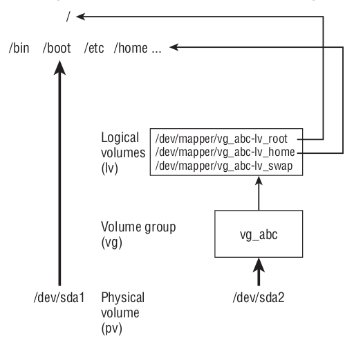

# Linux OS and networks

## **Contents**
* [Installing and working with a boot manager (GRUB 2)](#installing-and-working-with-a-boot-manager-grub-2)
* [Shared libraries managment](#shared-libraries-managment)
* [Process text streams using filters. Use streams, pipes and redirects](#process-text-streams-using-filters-use-streams-pipes-and-redirects)
* [Create, monitor and kill processes and working with cron](#create-monitor-and-kill-processes-and-working-with-cron)
* [Basic file editing operations using vi](#basic-file-editing-operations-using-vi)
* [Working with Logical Volume Managment (LVM)](#working-with-logical-volume-managment-lvm)
* [Logging](#logging)

## **Installing and working with a boot manager (GRUB 2)**

The instructions on this section are to be used with GRUB 2 boot manager. Usually modern linux installations come by default with a GRUB 2 manager installed, in case that is not installed on your system can be installed using the package manager of your current system like: apt, yum, etc.

### Folder/files olders of insterest
<hr/>

This file and directories locations could vary from OS to OS. The ones presented here were checked using Ubuntu OS

#### **1- Directory /boot/grub/:**

Heart of the GRUB 2 manager, that allow the system to boot with grub. On this dir is located a file called *grub.cfg* that store a script with the auto-generated configuration of GRUB. **Important!!** this configuration file must not manually edited cause will be overwrite on a update of the system 

#### **2- Directory /etc/grub.d/:**

This folder scripts that generate the the configuration of the GRUB loader in a order given by the number of the begining of the script file name. If you need to customize the GRUB 2 menu, you add your changes to a file in /etc/grub.d/ such as *40_custom*, or add your own file.

#### **3- File /etc/default/grub:**
Add or changes variables on this file to change the configuration/style of GRUB boot menu. To change to effect is need to run command `update-grub` or on others OS could be called `update-grub2`

**Important configuration variables**
* **GRUB_TIMEOUT:** Timeout on seconds to init system by defualt option
* **GRUB_DISTRIBUTOR:** String that shows system destribution name
* **GRUB_MENU_PICTURE:** Background picture to be showed on menu

### Commands of interest
<hr/>

**1- grub-install** build a new core image file on a device
```
[root@emiguel-ubuntu ~]# # Build a core.img file on Fedora 22
[root@emiguel-ubuntu ~]# grub2-install --recheck --grub-setup=/bin/true /dev/sda
Installing for i386-pc platform.
Installation finished. No error reported.
[root@emiguel-ubuntu ~]# ls -l /boot/grub2/i386-pc/core.img
-rw-r--r--. 1 root root 25887 Jul 12 22:56 /boot/grub2/i386-pc/core.img

root@emiguel-ubuntu:~$ # Build a core.img file on Ubuntu 14
root@emiguel-ubuntu:~$ sudo grub-install --non-sectarian /dev/sda
[sudo] password for root:
Installing for i386-pc platform.
Installation finished. No error reported.
root@emiguel-ubuntu:~$ ls -l /boot/grub/i386-pc/core.img
-rw-r--r-- 1 root root 25363 Jul 12 23:15 /boot/grub/i386-pc/core.img
```
**2- grub-mkrescue or grub2-mkrescue** command to help you create a rescue CD image

```
[root@emiguel-ubuntu ~]# # Build a core.img file on Fedora 22
[root@emiguel-ubuntu ~]# grub2-install --recheck --grub-setup=/bin/true /dev/sda
Installing for i386-pc platform.
Installation finished. No error reported.
[root@emiguel-ubuntu ~]# ls -l /boot/grub2/i386-pc/core.img
-rw-r--r--. 1 root root 25887 Jul 12 22:56 /boot/grub2/i386-pc/core.img

root@emiguel-ubuntu:~$ # Build a core.img file on Ubuntu 14
root@emiguel-ubuntu:~$ sudo grub-install --non-sectarian /dev/sda
[sudo] password for root:
Installing for i386-pc platform.
Installation finished. No error reported.
root@emiguel-ubuntu:~$ ls -l /boot/grub/i386-pc/core.img
-rw-r--r-- 1 root root 25363 Jul 12 23:15 /boot/grub/i386-pc/core.img
```
and use command `dd` to write the rescue image to a USB flash drive

```
root@emiguel-ubuntu:~$ # Burn .iso image to USB stick /dev/sde
root@emiguel-ubuntu:~$ sudo dd if=rescue.iso of=/dev/sde
9864+0 records in
9864+0 records out
5050368 bytes (5.1 MB) copied, 3.95946 s, 1.3 MB/s
```

**Booting with GRUB 2 rescue CD from existing GRUB installation**

Use the next example to repair a old grub installation that got hidden cause of a new OS installation.

From GRUB boot terminal use `ls` command to list the devices and search for the system that have a GRUB installation. Next follow the next steps:

* `set prefix=(hd1,gpt1)/boot/grub` *--to point grub root installation that you want to boot--*
* `set root=(hd1,gpt1)/` *-- partition root where GRUB  is installed --*
* `lsmod normal`
* `normal`

**3- grub-update** command to generate a new /boot/grub/grub.cfg file
```
root@emiguel-ubuntu:~$ sudo grub-update
Generating grub configuration file ...
Found linux image: /boot/vmlinuz-3.16.0-43-generic
Found initrd image: /boot/initrd.img-3.16.0-43-generic
Found linux image: /boot/vmlinuz-3.16.0-30-generic
Found initrd image: /boot/initrd.img-3.16.0-30-generic
Found memtest86+ image: /boot/memtest86+.elf
Found memtest86+ image: /boot/memtest86+.bin
Found Fedora release 20 (Heisenbug) on /dev/sda10
Found CentOS release 6.6 (Final) on /dev/sda11
Found Fedora release 22 (Twenty Two) on /dev/sda5
Found Slackware Linux (Slackware 13.37.0) on /dev/sda6
Found Fedora release 18 (Spherical Cow) on /dev/sda7
Found openSUSE 11.4 (x86_64) on /dev/sda8
Found Ubuntu 12.04 LTS (12.04) on /dev/sda9
done
```

## **Shared libraries managment**

Linux shared library can have three names. Which are:

* **Linker name** (eg: libexample.so)
* **Soname** (eg : libexample.so.1.2) Represent the major version of the library
* **Real Name** (eg : libexample.so.1.2.3) Minor version of the library. The actual name

Linker name points to the soname, and soname points to real name

### Commands of interest
<hr/>

* **ldconfig:** `ldconfig -n pathof_dir_where_shared_library_is_located`. This command is to install a custom shared library. *ldconfig* creates a symbolic with soname which points to the real name and update the cache which is used by programs to speed up the loading of shared libraries. ldconfig doesn’t setup the linker name. Therefore, you have to manually create a symbolic link with the linker name which points to the soname. The command you would have to execute for this purpose is `ln -s libexample.so.1.2 libexample.so`.
* **ldd:** `ldd` command print shared object dependencies
```
# example to check ls command shared libraries dependencies
emiguel@emiguel-ubuntu:~$ ldd /usr/bin/ls
linux-vdso.so.1 (0x00007fff5b38d000)
libselinux.so.1 => /lib/x86_64-linux-gnu/libselinux.so.1 (0x00007f45902a0000)
libc.so.6 => /lib/x86_64-linux-gnu/libc.so.6 (0x00007f45900ae000)
libpcre2-8.so.0 => /lib/x86_64-linux-gnu/libpcre2-8.so.0 (0x00007f459001e000)
libdl.so.2 => /lib/x86_64-linux-gnu/libdl.so.2 (0x00007f4590018000)
/lib64/ld-linux-x86-64.so.2 (0x00007f459030d000)
libpthread.so.0 => /lib/x86_64-linux-gnu/libpthread.so.0 (0x00007f458fff5000)
```

### Shared libraries directories
<hr/>

Use environment variable **LD_LIBRARY_PATH** to add new custom directories with dynamic libraries. Also you can modified file /etc/ld.so.conf to add new libraries instead the adding it to save dirs like */usr/lib*, */lib* or */usr/local/lib*

## **Process text streams using filters. Use streams, pipes and redirects**

### Imprtant metacharacters
<hr/>

Metacharacters are special characters that are used in Linux and any Unix-based system. Those metacharacters are as follows:

* **\>** Output redirection.   >>: Output redirection – append.
* **<** Input redirection.
* **<<** Input redirection.
* **\*** File substitution wildcard. This is used to match any string of none or more characters.
* **?** File substitution wildcard. This is used to match a single character.
* **[ ]** File substitution wildcard. This is used to match any of the characters inside the brackets.
* **|** Pipe for using multiple commands.
* **;** Command execution sequence.

### Filtering/ordering commands
* **sort:** Sort lines depending of the options
* **grep:** Obtain lines that matchs a pattern (include regex)
* **find:** Used to search for files location looking for names that match a expression
* **tail:** Show the last lines of a file
* **head:** Returns first line of a file
* **less:** Allow forward and backward movement through the lines of a file. Use this instead of more
* **wc:** Returns line of numbers, words, chars, depending of the parameters that you pass to the command.
* **tee:** This command is very similar to the cat command. Basically, it does the same thing, by copying the standard input to standard output with no alteration, but it also copies that into one or more files.
* **sed:** It is a data stream editor that edits files based on a strict set of rules supplied beforehand. Based on the rules, the command reads the file line by line and the data inside the file is then manipulated. sed is a non-interactive stream editor that makes changes based on a script, and in this respect, it is well suited for editing more files at once or for doing mundane repetitive tasks. 
  
### Piping between commands
<hr/>

The pipe (**|**) metacharacter connects the output from one command to the input of another
command. This lets you have one command work on some data and then have the next
command deal with the results, like the next example:

`gunzip < /usr/share/man/man1/grep.1.gz | nroff -c -man | less`

On this example, the contents of the grep man page (grep.1.gz) are directed to the
gunzip command to be unzipped. The output from gunzip is piped to the nroff com-
mand to format the man page using the manual macro (-man). The output is piped to the
less command to display the output. Because the fi le being displayed is in plain text, you
could have substituted any number of options to work with the text before displaying it.
You could sort the contents, change or delete some of the content, or bring in text from
other documents. The key is that, instead of all those features being in one program, you
get results from piping and redirecting input and output between multiple commands.

Other simplier way to to do the same will be:

`man grep | less`

### Commands redirections
<hr/>

Every single process in Linux has at least 3 communication channels available:

* Standard Input - STDIN
* Standard Output - STDOUT
* Standard Error - STDERR

The Kernel itself sets up those channels on the behalf of the process. The process itself doesn't necessarily know where they lead. Most Linux commands accept input from STDIN and write output in STDOUT. Error messages are written to STDERR. This allows you to connect commands together to create pipelines.

The Shell uses the symbols <,> and >> as instructions to reroute the instructions of a command input or output to or from a file. The < symbol is connecting the command's STDIN to the contents of an existing file. The > and the >> symbols redirect STDOUT. > replaces the file's existing contents and the >> symbols append to them.

The following command would store the text you type between the " " in a file. If the file doesn't exist, it will be created.

`echo "Test Message" > testmessage`


The next command would send an email with the contents of that file, so only the text, not the file itself, to the user Peter.

`mail -s "testmsg" peter < testmessage`
 
An example with the find command

If we use the find command we get a nice demonstration of why you would want to handle STDOUT and STDERR separately. If we run the following command:

`find / -name core`

We usually get a lot of Permission Denied error messages. To discard all of those error messages you can run the following command instead:

`find / -name core 2> /dev/null`

Which gives us a much cleaner result.

### Exercises and answers
<hr/>

1- Run the date command in such a way that the output from that command
produces the current day, month, date, and year. Have that read into another
command line, resulting in text that appears like the following (your date, of
course, will be different): Today is Thursday, December 10, 2015.

**Answer:**

`date +"Today is %A, %B %d, %Y"`

2- What is the command that creates a compressed archive with all the files inside the /etc directory that use the .conf extension?
Hint: Use the tar command.

**Answer:**

**All .conf on the first level on /etc folder:** 

`tar -cv /etc/*.conf > all_etc_conf.tar`

**Recursively all .conf files on /etc folder** 
```
find /etc/ -name *.conf -print0 2> /dev/null | tar --create --verbose --file all_etc_conf.tar --null -T -
``` 
**-print0** to specify i find also the filename with blan spaces, the **-T** option in tar the use as input a file, in this case the result of find and the **-** at the end of tar to specify use the STDIN as input file.

3- What is the command that lists the first five files inside /etc and sorts them by dimension in descending order?
Hint: Use find combined with sort and head.

**Answer**

`find /etc -maxdepth 1 -type f -print0 | du --files0-from=- | sort -gr | head -5`

4- What is the command that searches for files with three different extensions inside root?

Hint: Use the find command.

**Answer**

`find / -type f \( -name "*.c" -o -name "*.sh" -o -name "*.py" \)`

5- How do you find out when sudo was last used and which commands were executed by it?

Hint: Use the grep command.

**Answer**

`history | grep sudo`

## Create, monitor and kill processes and working with cron

### Commands of interest
<hr/>

* **pstree:** displays the whole process tree, and it shows the init process at its root; in our case, systemd (on Ubuntu or CentOS)
* **ps:** List the process
* **kill:** Kill process passing the process PID (process identifier)
* **top:** Show on realtime the CPUs and other info of the process
* **mkfifo:** Make FIFOs (named pipes)

### Interprocess communication (IPC)
<hr/>

* **Shared storage (file):** n its simplest form, the shared storage of an IPC mechanism can be a simple file that's been saved to disk. The producer then writes to a file while the consumer reads from the same file. In this simple use case, the obvious challenge is the integrity of the read/write operations due to possible race conditions between the underlying operations.
* **Shared memory:** Processes in Linux typically have separate address spaces. A process can only access data in the memory of another process if the two share a common memory segment where such data would be stored. Linux provides at least a couple of Application Programming Interfaces (APIs) to programmatically define and control shared memory between processes
* **Unnamed pipes:** The key element of the preceding illustration is the pipe (|) symbol. The left-hand side of the pipe produces an output that's fed directly to the right-hand side of the pipe for consumption.
* **Named pipes:** Named pipes, also known as First In, First Outs (FIFOs), are similar to traditional (unnamed) pipes but substantially different in terms of their semantics. An unnamed pipe only persists for as long as the related process is running. However, a named pipe has backing storage and will last as long as the system is up, regardless of the running status of the processes attached to the related IPC channel.
* **Message queues:** A message queue is an asynchronous communication mechanism that's typically used in a distributed system architecture. Messages are written and stored in a queue until they are processed and eventually deleted. A message is written (published) by a producer and is processed only once, typically by a single consumer. At a very high level, a message has a sequence, a payload, and a type. Message queues can regulate the retrieval (order) of messages (for example, based on priority or type)
* **Sockets:** There are two types of IPC socket-based facilities:

  1- IPC sockets: Also known as Unix domain sockets

  2- Network sockets: Transport Control Protocol (TCP) and User Datagram Protocol (UDP) sockets

  IPC sockets use a local file as a socket address and enable bidirectional communication between processes on the same host. On the other hand, network sockets extend the IPC data connectivity layer beyond the local machine via TCP/UDP networking. Apart from the obvious implementation differences, the IPC socket's and network socket's data communication channel behave the same.

### Signals and their values
<hr/>

```
 1) SIGHUP	 2) SIGINT	 3) SIGQUIT	 4) SIGILL	 5) SIGTRAP
 6) SIGABRT	 7) SIGBUS	 8) SIGFPE	 9) SIGKILL	10) SIGUSR1
11) SIGSEGV	12) SIGUSR2	13) SIGPIPE	14) SIGALRM	15) SIGTERM
16) SIGSTKFLT	17) SIGCHLD	18) SIGCONT	19) SIGSTOP	20) SIGTSTP
21) SIGTTIN	22) SIGTTOU	23) SIGURG	24) SIGXCPU	25) SIGXFSZ
26) SIGVTALRM	27) SIGPROF	28) SIGWINCH	29) SIGIO	30) SIGPWR
31) SIGSYS	34) SIGRTMIN	35) SIGRTMIN+1	36) SIGRTMIN+2	37) SIGRTMIN+3
38) SIGRTMIN+4	39) SIGRTMIN+5	40) SIGRTMIN+6	41) SIGRTMIN+7	42) SIGRTMIN+8
43) SIGRTMIN+9	44) SIGRTMIN+10	45) SIGRTMIN+11	46) SIGRTMIN+12	47) SIGRTMIN+13
48) SIGRTMIN+14	49) SIGRTMIN+15	50) SIGRTMAX-14	51) SIGRTMAX-13	52) SIGRTMAX-12
53) SIGRTMAX-11	54) SIGRTMAX-10	55) SIGRTMAX-9	56) SIGRTMAX-8	57) SIGRTMAX-7
58) SIGRTMAX-6	59) SIGRTMAX-5	60) SIGRTMAX-4	61) SIGRTMAX-3	62) SIGRTMAX-2
```

## Basic file editing operations using vi

### Adding text
<hr/>

To get into input mode, type an input command letter. To begin, type any of the following
letters. When you are fi nished inputting text, press the Esc key (sometimes twice) to return
to command mode. Remember the Esc key!

*  **a** — The add command. With this command, you can input text that starts to the
right of the cursor.
 * **A** — The add at end command. With this command, you can input text starting at
the end of the current line.

* **i** — The insert command. With this command, you can input text that starts to the
left of the cursor.
* **I** — The insert at beginning command. With this command, you can input text that
starts at the beginning of the current line.
* **o** — The open below command. This command opens a line below the current line
and puts you in insert mode.
* **O** — The open above command. This command opens a line above the current line
and puts you in insert mode.

**Tip** Use ESC to return to command mode

### Moving around in the text
<hr/>

To move around in the text, you can use the up, down, right, and left arrows. However,
many of the keys for moving around are right under your fi ngertips when they are in
typing position:

 * **Arrow keys** — Move the cursor up, down, left, or right in the fi le one character
at a time. To move left and right, you can also use Backspace and the spacebar,
respectively. If you prefer to keep your fi ngers on the keyboard, move the cursor
with h (left), l (right), j (down), or k (up).
* **w** — Moves the cursor to the beginning of the next word (delimited by spaces, tabs,
or punctuation).
* **W** — Moves the cursor to the beginning of the next word (delimited by spaces or tabs).
* **b** — Moves the cursor to the beginning of the previous word (delimited by spaces,
tabs, or punctuation).
* **B** Moves the cursor to the beginning of the previous word (delimited by spaces
or tabs).
* **0 (zero)** — Moves the cursor to the beginning of the current line.
* **$** — Moves the cursor to the end of the current line.
* **H** — Moves the cursor to the upper-left corner of the screen (fi rst line on the screen).
* **M** — Moves the cursor to the fi rst character of the middle line on the screen.
* **L** — Moves the cursor to the lower-left corner of the screen (last line on the screen).

### Deleting, copying, and changing text
</hr>

The only other editing you need to know is how to delete, copy, or change text. The x, d,
y, and c commands can be used to delete and change text. These can be used along with
movement keys (arrows, PgUp, PgDn, letters, and special keys) and numbers to indicate
exactly what you are deleting, copying, or changing. Consider the following examples:

* **x** — Deletes the character under the cursor.
* **X** — Deletes the character directly before the cursor.
* **d<?>** — Deletes some text.
* **c<?>** — Changes some text.
* **y<?>** — Yanks (copies) some text.

The <?> after each letter in the preceding list identifi es the place where you can use a
movement command to choose what you are deleting, changing, or yanking. For example:

* **dw** — Deletes (d) a word (w) after the current cursor position.
* **db** — Deletes (d) a word (b) before the current cursor position.
* **dd** — Deletes (d) the entire current line (d).
* **c$** — Changes (c) the characters (actually erases them) from the current character
to the end of the current line ($) and goes into input mode.
* **c0** — Changes (c) (again, erases characters) from the previous character to the
beginning of the current line (0) and goes into input mode.
* **cl** — Erases (c) the current letter (l) and goes into input mode.
* **cc** — Erases (c) the line (c) and goes into input mode.
* **yy** — Copies (y) the current line (y) into the buffer.
* **y)** — Copies (y) the current sentence ( ) ), to the right of the cursor, into the buffer.
* **y}** — Copies (y) the current paragraph ( } ), to the right of the cursor, into the buffer.

Any of the commands just shown can be further modifi ed using numbers, as you can see in
the following examples:

* **3dd** — Deletes (d) three (3) lines (d), beginning at the current line.
* **3dw** — Deletes (d) the next three (3) words (w).
* **5cl** — Changes (c) the next fi ve (5) letters (l) (that is, removes the letters and
enters input mode).
* **12j** — Moves down (j) 12 lines (12).
* **5cw** — Erases (c) the next fi ve (5) words (w) and goes into input mode.
* **4y)** — Copies (y) the next four (4) sentences ( ) ).

### Pasting (putting) text
<hr/>
After text has been copied to the buffer (by deleting, changing, or yanking it), you can
place that text back in your fi le using the letter p or P. With both commands, the text most
recently stored in the buffer is put into the fi le in different ways.

* **P** — Puts the copied text to the left of the cursor if the text consists of letters or
words; puts the copied text above the current line if the copied text contains
lines of text.
* **p** — Puts the buffered text to the right of the cursor if the text consists of letters or
words; puts the buffered text below the current line if the buffered text contains
lines of text.

### Searching for text
<hr/>

To search for the next or previous occurrence of text in the fi le, use either the slash (/) or
the question mark (?) character. Follow the slash or question mark with a pattern (string of
text) to search forward or backward, respectively, for that pattern. Within the search, you
can also use metacharacters. Here are some examples:
* **/hello** — Searches forward for the word hello.
* **?goodbye** — Searches backward for the word goodbye.
* **/The.\*foot** — Searches forward for a line that has the word The in it and also,
after that at some point, the word foot.
* **?\[pP]rint** — Searches backward for either print or Print. Remember that case
matters in Linux, so make use of brackets to search for words that could have
different capitalization.

After you have entered a search term, simply type n or N to search again in the same
direction (n) or the opposite direction (N) for the term.

### Exiting vi
<hr/>

To wrap things up, use the following commands to save or quit the file

* **ZZ** — Saves the current changes to the fi le and exits from vi.
* **:w** — Saves the current fi le but doesn't exit from vi.
* **:wq** — Works the same as ZZ.
* **:q** — Quits the current fi le. This works only if you don’t have any unsaved changes.
* **:q!** — Quits the current fi le and doesn’t save the changes you just made to the fi le.

## Mounting and unmounting filesystems

### Mounting/unmounting
<hr/>

1- Creating a directory to mount the partition

`sudo mkdir /mnt/hdd`

2- Mount the partition using the following command:

`sudo mount /dev/sda /mnt/hdd`

3- Using `sudo umount /dev/sda` to unmount partition

### Persistent mounting
<hr/>
Mounting a filesystem only makes them available until the system is shut down or rebooted. If you want the changes to be persistent, you will have to edit the /etc/fstab file accordingly. First, open the file with your favorite text editor:

sudo nano /etc/fstab

Add a new line similar to the one that follows:

`LABEL=NEW_STORAGE /dev/sda /mnt/sdb ext4 defaults 0 0`

## Working with Logical Volume Managment (LVM)
### Diagram of LVM
<hr/>



### Commands of interest
<hr/>

* **pvcreate** - Create the LVM physical volume. Ex: `pvcreate /dev/sda`.
* **vgcreate** - Create a new volume group to add the new physical volume. Exmple:
`vgcreate new_volumne_name /dev/sda`
* **vgdisplay** - Show information a volumen group. Example: `vgdisplay new_volumne_name`
* **lvcreate** - Create a logical volume and add to a volume group. Example: `lvcreate -n music -L 100M new_volumne_name`, this command create a logical volume named muscic with a size of 100 MB to the volume group `new_volumne_name`. This procedure create a device named /dev/mapper/new_volumne_name-music. That device can now be used to put a filesystem on and mount, just as you did with regular partitions in the fi rst part of this chapter. For example:

  1- `mkfs -t ext4 /dev/mapper/new_volumne_name-music` to format the filesystem to ext4

  2- `mkdir /mnt/mymusic` create a dir to mount the device

  3- `mount /dev/mapper/new_volumne_name-music /mnt/mymusic` mounts the device

  4- `df -h /mnt/mymusic` to check the new disk layout

  5- To make them permanent, you will have to edit the */etc/fstab* and add the next line 
  
  `/dev/mapper/new_volumne_name-projects /mnt/mymusic ext4 defaults 1 2`

  **Snapshots:** You can use lvcreate to create snapshot passing -s as argument like this `lvcreate -s -L 5G -n music-snap01 /dev/mapper/new_volumne_name-music`. This create a snapshot of the logical volume new_volumne_name-music of 5G wth label music-snap01.

  1- Cn be used *lvextend* to extend the size of the snapshot.

  2- To restore a snapshot, first you would need to unmount the filesystem. To unmount, we will use the umount command: `sudo umount /mnt/mymusic`. And then we can proceed to restore the snapshot with the lvconvert command like this: `lconvert --merge /dev/mapper/new_volumne_name-music--snap01`. After that the snapshot is removed.

* **lvextend** - Use to extend the size of a logical volume with space available on the volume group. Example 

  1- `lvextend -L +5G /dev/mapper/new_volumne_name-music` Adds 5G to the logical volume

  2- Then resize the filesystem to fit the new size of the logical volume using *resize2fs*. Example: `resize2fs -p /dev/mapper/new_volumne_name-music`

## Logging
### Facilities code
<hr/>

|Code|Facility|Description|
|----|--------|-----------|
|0	 | kern	Kernel|  messages|
|1	 |user	  |User-level messages|
|2	 |mail	  |Mail system|
|3	 |daemon  | System daemons|
|4	 |auth	  |Security/authorization messages|
|5	 |syslog	|Messages generated internally by syslogd|
|6	 |lpr	|Line printer subsystem|
|7	 |news	| Network news subsystem|
|8	 | uucp	|UUCP subsystem|
|9	 |cron	|Clock daemon|
|10	 |authpriv	|Security/authentication messages|
|11|	ftp	| FTP daemon|
|12|	ntp	|NTP subsystem|
|13|	security	| Log audit |
|14|	console	| Log alert|
|15|	clock	|Clock daemon|
|16-23|	local0 - local7	|Locally used facilities|

### Priorities codes
<hr/>

|Code|Priority|Description|
|----|--------|-----------|
|0|	emergency	|System is unusable|
|1|	alert	|Action must be taken immediately|
|2|	critical	|Critical conditions|
|3|	error	|Error Conditions|
|4|	warning	|Warning conditions|
|5|	notice	|Normal but significant condition|

**File /etc/rsyslog.con:** Add configuration like this 
```
# <facility>.<severity>    <action>
mail.notice /var/log/mail_errors
```

**tail:** By default, tail displays the last ten lines written to a file. Using the follow option (-f or --follow
) allows you to monitor the file continuously. As new lines are written, they are printed to the user’s terminal.